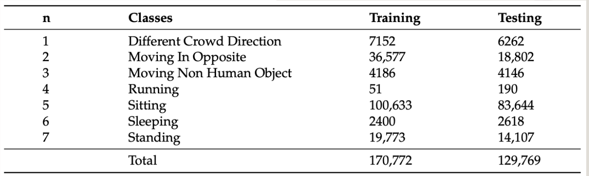
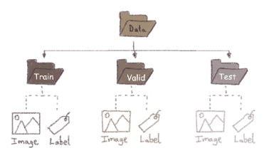

   

## Team members:
   - Razan Alyahya
   - Abdulaziz Alzahrani
   - Osama Alyami
         
## Problem:
The Hajj, a large-scale religious pilgrimage in Makkah, Saudi Arabia, attracts over two million pilgrims from various countries. The project aims to help automate the detection, tracking, and recognition of abnormal behaviors in large-scale crowds using surveillance cameras to ensure pilgrims’ safety in a smooth flow during Hajj. It also helps security authorities and decision-makers visualize and anticipate potential risks.

## Dataset Overview:
The HAJJ dataset is a collection of nine videos from the annual Hajj religious event, capturing individuals' abnormal behaviors in massive crowds. The videos, captured in various scenes (“Massaa”,“Jamarat”, “Arafat”, and “Tawaf”), are cropped and split into training and testing sets. The videos show various abnormal behaviors, including standing, sitting, sleeping, running, and non-pedestrian activities, which can pose a risk to large-scale crowd flows.

   

## Model Building:
- Extracting the frames from the videos and save them.
- Convert the annotation to YOLOv5 format.
 
  

 

- YOLOv5 with ResNet50 Backbone for Abnormal Object Detection.
- Optical Flow Feature Extraction using Horn–Schunck.
- Random Forest (RF) Classification for Object Categorization.
- Kalman Filter for Object Tracking.

## Used Technologies 

  

 

